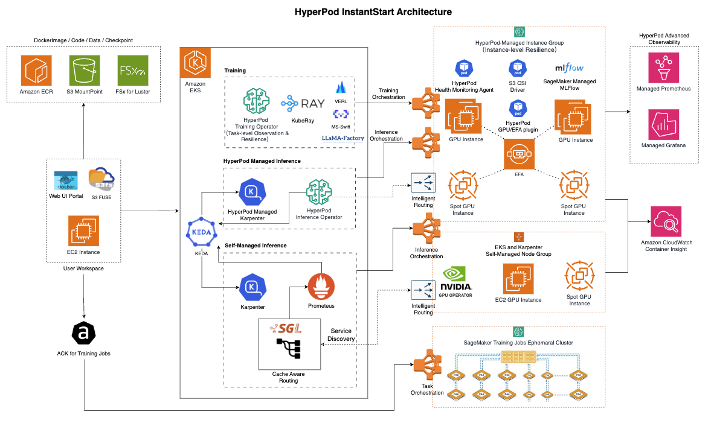

# HyperPod-InstantStart

HyperPod InstantStart is a training-and-inference integrated platform built on SageMaker HyperPod. It utilizes standard EKS orchestration and supports training and inference tasks with arbitrary GPU resource granularity. 

## Overview

HyperPod-InstantStart provides a unified interface for managing ML infrastructure, from cluster provisioning to training job orchestration and model serving.

- For training, it can leverage standard Kubeflow on Kubernetes (compatible with both EC2 and HyperPod nodes), the HyperPod Training Operator (applicable to HyperPod nodes, significantly simplifying distributed configuration with process-level recovery and log exception monitoring; optional), or KubeRay (as an orchestrator for the reinforcement learning framework VERL). 
- For inference, it supports deployment on single or multi-node setups using arbitrary containers, such as standard vLLM/SGLang or self-buit containers, while also providing standardized API exposure (e.g., OpenAI-compatible API). 
- Additionally, it offers managed MLFlow Tracking Server for storing training metrics, enabling sharing and collaboration with fine-grained IAM permission controls.

## Architecture

## Demo Videos
[Watch the demo video](./resources/deploy.mp4)

### Create HyperPod Cluster
<video width="600" controls>
  <source src="./resources/hypd-create.mp4" type="video/mp4">
  Your browser does not support the video tag.
</video>

### Download Model from HuggingFace
<video width="600" controls>
  <source src="./resources/model-download.mp4" type="video/mp4">
  Your browser does not support the video tag.
</video>

### Model Deployment from S3
<video width="600" controls>
  <source src="./resources/deploy.mp4" type="video/mp4">
  Your browser does not support the video tag.
</video>

### Distributed Verl Training with KubeRay
<video width="600" controls>
  <source src="./resources/verl.mp4" type="video/mp4">
  Your browser does not support the video tag.
</video>

## Key Components in Web UI Panel

- **Cluster Management**: Supports EKS cluster creation, importing existing EKS clusters, cluster environment configuration, HyperPod cluster creation and scaling, EKS Node Group creation
- **Model Management**: Supports multiple S3 CSI configurations, as well as HuggingFace model downloads (CPU Pod)
- **Inference**: Hosting for vLLM, SGLang or any custom container, with support for binding Pods to different Services (no need to repeatedly destroy and create Pods during resource rebalancing)
- **Training**: Supports model training patterns including LlamaFactory, Verl, and Torch Script
- **Training History**: Integration with SageMaker-managed MLFlow creation and display/sharing of training performance metrics

For detailed setup instructions, please refer to [Feishu Doc (zh_cn)](https://amzn-chn.feishu.cn/docx/VZfAdXTJKor7TCxPrZdcbGYXnaf?from=from_copylink), or [Lark Doc (en)](https://amzn-chn.feishu.cn/wiki/KKgVwwfiuiof9KkAP0CcYXfnnqd?from=from_copylink)

## Feature Roadmap
- (Cluster Building) Multi-type Instance Groups
- (Cluster Building) Flexible Cluster dependency configuration
- (Training) TorchTitan/Whisper Training Recipe Integration
- (Inference) Cross node EP and PD Disaggregated Integration

